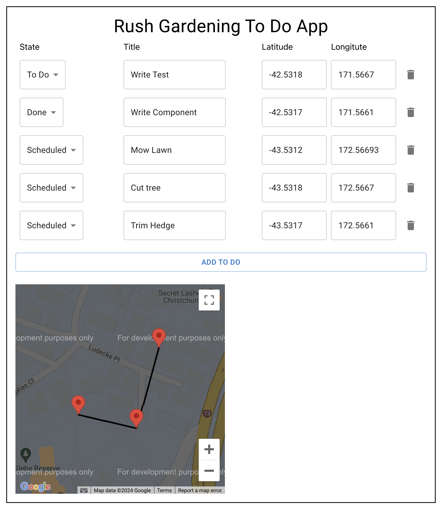

# Rush Gardening To Do App

This app is a todo list app that allow gardener to schedule a service list and include a location. The scheduled locations are shown on the map by solving using traveling sales man algorithm assuming line of flight path.

## Available Scripts

In the project directory, you can run:

### `npm start`

Runs the app in the development mode.\
Open [http://localhost:3000](http://localhost:3000) to view it in the browser.

The page will reload if you make edits.\
You will also see any lint errors in the console.

To learn React, check out the [React documentation](https://reactjs.org/).
